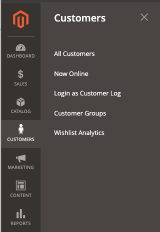

# Magento 2 Wishlist Analytics

<strong>Mdbhojwani_StorePricing</strong> 

## Table of contents

- [Summary](#summary)
- [Installation](#installation)
- [Configurations](#configurations)
- [License](#license)

## Summary

Analyze customer preferences and make data-driven decisions with the Magento 2 Wishlist Analytics extension.

### Key features:
1. See all customer's wishlists on one grid
2. Track the most popular items in your store
3. Control the stock quantity and avoid out-of-stocks
4. Go to product editing in one click
5. Sort items by their popularity

## Installation

You can install the Extension using one of two methods:
 1. Via Composer 
 2. By downloading it directly from the available source.
 
### 1. Install via composer

To install the Extension via Composer, follow these steps in  your Magento 2 root folder:

Run the following command:
```shell
composer require mdbhojwani/magento2-wishlist-analytics
```
After a successful installation, execute the following commands:

```shell
php bin/magento setup:upgrade
php bin/magento setup:static-content:deploy -f
php bin/magento c:c
```

With these steps completed, you'll be ready to utilize the Extension.

### 2. Download Directly

To install the Mdbhojwani Save For Later Extension you can download the Extension from below link:

https://github.com/mdbhojwani/magento2-wishlist-analytics

After successfully downloading the module, follow these steps to install it:

1.Unzip the downloaded folder.

2.Place the unzipped extension folder into the following path:

```shell
project-root-directory/app/code/Mdbhojwani/WishlistAnalytics
```

Indeed, after placing the extension folder in the specified directory, follow these Magento commands to complete the installation:
```shell
php bin/magento setup:upgrade
php bin/magento setup:static-content:deploy -f
php bin/magento c:c
```

By following these 2 Ways you can easily obtain and install the module. For detailed instructions on its usage, refer to the user guide within this document.


## Configurations

Login to the **Magento Admin**, navigate to Configurations
Path: `Store > Content -> Wishlist Analytics`.

<div>
    
</div><br/>

## License

[Open Software License ("OSL") v. 3.0](https://opensource.org/license/osl-3-0-php)

